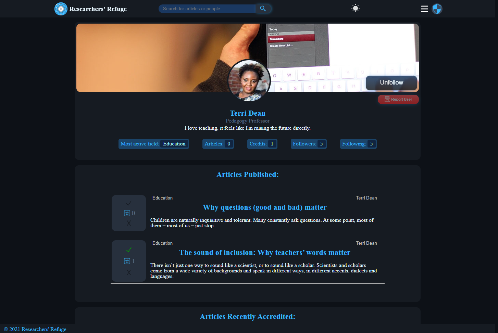
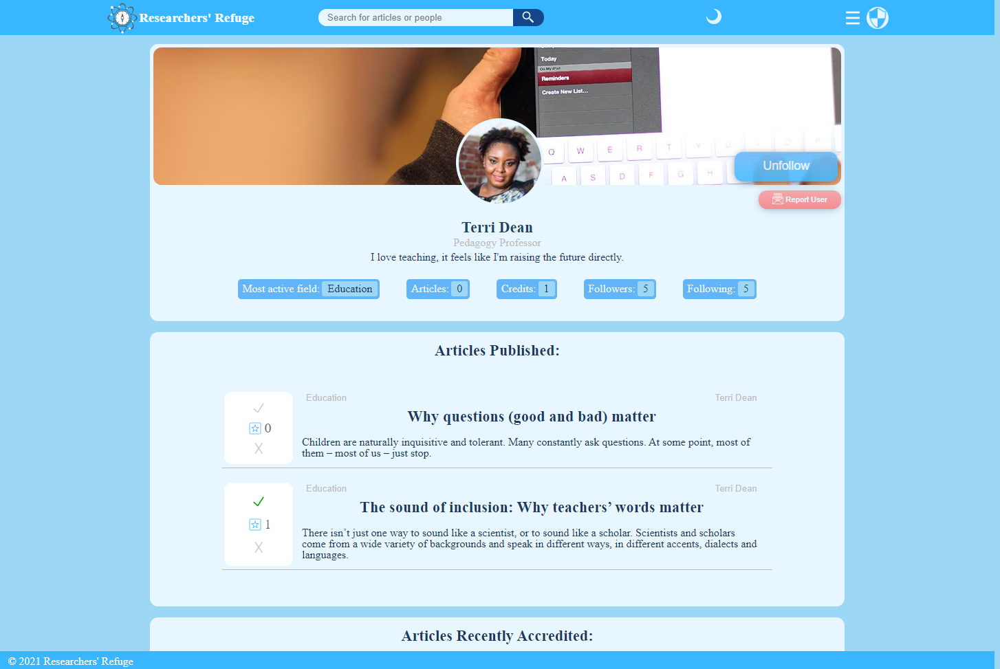
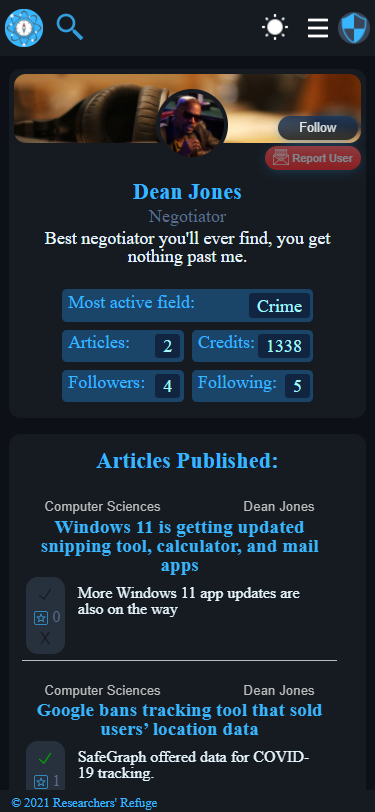
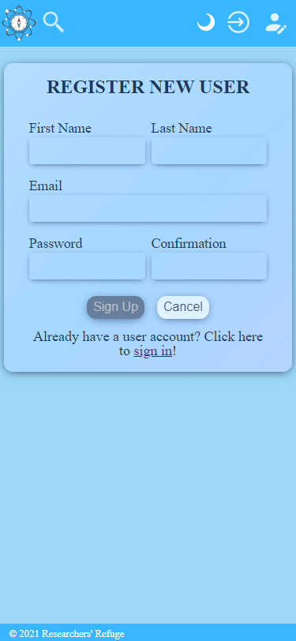

---

| <a href='https://researchers-refuge.herokuapp.com/'><button>✅ Live Demo</button></a>
| <a href='https://github.com/skoms/researchers-refuge-api'><button>⚙️ Back-End API Repository</button></a>
| <a href='https://github.com/skoms'><button><svg xmlns="http://www.w3.org/2000/svg" width="16" height="14" fill="currentColor" class="bi bi-github" viewBox="0 0 16 16">
<path d="M8 0C3.58 0 0 3.58 0 8c0 3.54 2.29 6.53 5.47 7.59.4.07.55-.17.55-.38 0-.19-.01-.82-.01-1.49-2.01.37-2.53-.49-2.69-.94-.09-.23-.48-.94-.82-1.13-.28-.15-.68-.52-.01-.53.63-.01 1.08.58 1.23.82.72 1.21 1.87.87 2.33.66.07-.52.28-.87.51-1.07-1.78-.2-3.64-.89-3.64-3.95 0-.87.31-1.59.82-2.15-.08-.2-.36-1.02.08-2.12 0 0 .67-.21 2.2.82.64-.18 1.32-.27 2-.27.68 0 1.36.09 2 .27 1.53-1.04 2.2-.82 2.2-.82.44 1.1.16 1.92.08 2.12.51.56.82 1.27.82 2.15 0 3.07-1.87 3.75-3.65 3.95.29.25.54.73.54 1.48 0 1.07-.01 1.93-.01 2.2 0 .21.15.46.55.38A8.012 8.012 0 0 0 16 8c0-4.42-3.58-8-8-8z"/>
</svg> Skoms' GitHub</button></a>
|

_On live demo please allow the website 30 seconds for cold-startup_

---

<!-- vscode-markdown-toc -->

## 📋 Table Of Contents

1. [🗒️ Description](#Description)
2. [📓 How To Install](#HowToInstall)
3. [📘 Features](#Features)
4. [📖 Future Features](#FutureFeatures)
5. [👀 Preview](#Preview)
   1. [🗔 Desktop - Dark Mode](#Desktop-DarkMode)
   2. [🗔 Desktop - Light Mode](#Desktop-LightMode)
   3. [📱 Mobile](#Mobile)
6. [🔐 Admin Panel](#AdminPanel)
   1. [🗒️ Description](#Description-1)
   2. [👀 Preview](#Preview-1)
7. [💡 Idea](#Idea)
8. [🌟 Motivation](#Motivation)
9. [📚 What I learnt](#WhatIlearnt)

<!-- vscode-markdown-toc-config
	numbering=true
	autoSave=true
	/vscode-markdown-toc-config -->
<!-- /vscode-markdown-toc -->

---

## 1. 🗒️ Description

This website is a social media inspired by Reddit and LinkedIn. It is a fullstack application with this front-end client, and a back-end REST API with a relational PostgreSQL Database. The website is intended for researchers or other professionals wanting to have a social platform they can read and write study articles and other research papers sharing their discoveries while also being able to discover what other users are working on, allowing them to follow each other and accredit / discredit articles. That is the base of the entire website, that is the problem it could solve. In real life though, it is intended to improve and display my coding skills as a project for potential employers. Thank you for taking the time to have a look!

## 2. 📓 How To Install

1. <a href='#'>Make sure to install and start the API</a>
2. Clone this repo by clicking the clone button or with command line:
   "`git clone https://github.com/skoms/researchers-refuge.git`"
3. Open the files downloaded and install dependencies (Command: "`npm install`")
4. In the project root folder, create a `.env` file and add this line "`REACT_APP_DEV_API=http://localhost:5000/api`" and save the file
5. Run the program (Command: `npm start`), this should open the browser with the website, if not, open browser on "`http://localhost:3000`"
6. To use either create your own user, or use demo user: `email: demo@user.com, password: demoUser123`

## 3. 📘 Features

- Authentication: Lets you sign up and sign in to user accounts

- Authorization: Has access levels and webpages that can only be accessed with a certain admin role or that requires you be signed in.

- Articles: Lets you view, update, and post articles to the website to be seen by both you and others. The articles can also be accredited, discredited or even reported.

- Users: Lets you view, update, and create users to the website, where you can view your own or others profiles. The users can also be followed, unfollow or even reported.

- Searching: Lets you utilize the headers search bar to search for articles, people, topics etc, that will then take you to a search results page.

- Topic Select: Lets you select the topic you want the feed to be filtered by, the default 'home' means you do not want to filter by topic.

- Dark Mode Button: Lets you select whether or not you want to display the website in dark mode or light mode, this decision gets preserved throughout reloads using cookies.

- Sign Buttons: Lets you either sign in or up, taking you to the relevant page to do so.

- Header Menu Button: drops down a header menu that lets you either navigate to different places like your own profile or lets you sign out.

- Article Feed: lets you browse articles filtered by the menu bar, where you the default shows 'popular', which is the highest rated articles from the last month, you also have options, new, top and following, which are all self-explanatory.

- Article Cards: Is the container holding the article cards, which has its own scrolling and pagination bar if there more articles.

- Article Card: Displays basic information about the article, like the title, into, topic and author.

- Info Module: Displays more information about your own profile on the left sidebar.

- Recommended Module: Displays recommended content or users that might be interesting to you, if no recommendations / on mobile it wont display at all.

- Article Details: Is the page when looking at an article, this page will allow you to see more information on the article, the author and related articles if anyone is applicable. Will also give you the option to report the article if its not yours, and options to edit or delete if its either yours or you're an admin.

- Your / User Profile: Displays information about you/them like statistics, your/their profile/header images, articles published by you/them, and more. On your profile only it will also display a recommendation module for 'people you may know', if there are any.

- Report Modal: If you have an issue with either a bug, a user or an article, you can press the applicable red report button, or use the 'Report Bug' button in the header menu. Note that you have to be logged in to report a bug.

- Admin Panel: As this is intended to stay true to how an application would be made for a client, it is also included an admin panel where users with the access role of Admin gets access to a panel where they can manage practically any data on the database. Here the admin can also decide to block a user or article. For more information about the admin panel, please do check its section for a preview.

<a href='#'>To Top</a>

## 4. 📖 Future Features

- Commenting
- Notifications
- Chatting

<a href='#'>To Top</a>

## 5. 👀 Preview

### 5.1. 🗔 Desktop - Dark Mode

| Dark Mode                                              | Description                       |
| ------------------------------------------------------ | --------------------------------- |
|  | Home Screen, Not logged in        |
|      | Home Screen, Logged in            |
|          | Article Page, With rights to edit |
|   | Update Article Page               |
|       | My profile page                   |
|     | User profile page                 |
|          | User Sign Up                      |
|   | Search Results                    |

<a href='#'>To Top</a>

### 5.2. 🗔 Desktop - Light Mode

| Light Mode                                              | Description                       |
| ------------------------------------------------------- | --------------------------------- |
|  | Home Screen, Not logged in        |
|      | Home Screen, Logged in            |
|          | Article Page, With rights to edit |
|   | Update Article Page               |
|       | My profile page                   |
|     | User profile page                 |
|          | User Sign Up                      |
|   | Search Results                    |

<a href='#'>To Top</a>

### 5.3. 📱 Mobile

| Dark Mode                                                     | Light Mode                                                     | Description                       |
| ------------------------------------------------------------- | -------------------------------------------------------------- | --------------------------------- |
|  |  | Home Screen, Not logged in        |
|      |      | Home Screen, Logged in            |
|          |          | Article Page, With rights to edit |
|   |   | Update Article Page               |
|       |       | My profile page                   |
|     |     | User profile page                 |
|          |          | User Sign Up                      |
|   |   | Search Results                    |

<a href='#'>To Top</a>

## 6. 🔠Admin Panel

### 6.1. 🗒️ Description

The Admin Panels main purpose is to help the administrators manage the data stored in the Database without having to out of their way to do that with SQL injection, but rather do it directly and more conveniently through the website itself. It is not only for general data management here, it also shows some basic statistics, but most importantly is the only was to access the Report Center apart from using SQL to select the table with the Database. In the Report center, you can read, edit, delete, and mark reports as either open, resolved or rejected, new reports naturally default to 'open'. For a preview of how the admin panel would look, Start up the project or take a look at the preview below.

<a href='#'>To Top</a>

### 6.2. 👀 Preview

| Dark Mode                                         | Description                     |
| ------------------------------------------------- | ------------------------------- |
|      | Statistics                      |
|      | Management Table                |
|    | Sidebar menu                    |
|       | Table sort feature              |
|  | Action menu for block/delete    |
|       | Report Center: Open Reports     |
|   | Report Center: Resolved Reports |
|   | Report Center: Rejected Reports |

<a href='#'>To Top</a>

## 7. 💡 Idea

Reddit/LinkedIn inspired website where one can log in and browse through research articles and such on main 'hot' page or 'new' etc. Can also follow other Researchers to be prompted or have their articles show up on their main page. Should also have a 'like' / 'support' system to give feedback to other researchers well written articles etc. Recommendations should also be in place for new users and in general, which would recommend researchers and/or articles according to fields of study that user is interested in or general popularity the researcher has accumulated.

<a href='#'>To Top</a>

## 8. 🌟 Motivation

My motivation building this particular project was to build a large-scale fullstack application that would challenge me and teach me tons of new technologies and further my knowledge in my core stack. Also to help round out the base of my knowledge of each component of a larger project.

<a href='#'>To Top</a>

## 9. 📚 What I learnt

It is impossible for me to put down in words or even remember all I learnt thus far in the project, that is per date worked on consistently for about 3 months. But heres some of the more impactful things it has taught me:

- STACK: I learned that my stack was initially not perfectly rounded as in I was using SQLite relational database, which needlessly to say isn't necessarily considered the best or strictest one out there. Learning that the hard way, I transitioned over to PostgreSQL. Rounding out my stack to the ⚙️P.E.R.N. (PostgreSQL, Express, React, Node.js) stack.

- Testing: Previous to this project my ability in testing and knowledge was very limited apart from basic syntax. I did some research on testing both React and when/how to test Redux Stores etc., and landed on React Testing Library with Jest, occasionally breaking its rule on testing state 😅 With this I have implemented both Unit tests and Integration Tests.

- Mock Service Worker: MSW is something I also decided was worth picking up as I was getting into the testing, most of which relying on asynchronous fetching, often more that a couple. This lead into quite the mess with just intercepting the single request, not always 100% which would be called first. But through a few days of head-scratching and trial and error, I feel I have figured it out to quite the extent, at least to the extent needed, and I am happy I took the time.

- State Management: I learnt a lot more about state management in this project using Redux Toolkit🛠️. This is not my first rodeo with the toolkit, so I was already fairly familiar with its rules and ways, however this has been immensely improved since and I'm more confident than ever.

- Project Structuring: I have been very back and forth with structure in this project to see what is considered best practice and more importantly what seems right. I am currently very happy with my structure, with some ideas how to improve it further. But overall, I feel this project and its size has brought my from structure 'zero' to structure almost 'hero'. Just one example is how I transitioned from a 3000 line global styles file, to have each component have personalized style files, and reducing the global styles by several thousand lines.

- Best Practices: Trying to use the best practices is something I have been trying to do throughout the whole project, and I feel it has improve my programming method and style a lot, making it an overall more professional code. When visiting code I wrote back in the start of the project I can already see a huge difference in both approach and style, and I've had to refactor a lot of it when spotted. It is quite astonishing to see the difference in a mere few months of actively trying to learn and just writing a lot of code.

- Hooks and Custom Hooks: Before starting my hooks knowledge was very basic, just knowing the few basic hooks like useState and useEffect. But with the lust for getting better, I have done much to learn and use hooks like useRef. On this pursuit I have also stumbled upon many youtube videos that explore what you can do with custom hooks and how to make some very useful ones, many of which I tagged along on and implemented.

- Utility files: Before this project, if I needed a utility function, I would usually just make it and use it in the files I needed them, using copy and paste. But knowing this is generally a bad practice, and is definitely not DRY, I have made an effort to simplify this by making external files for these. Good examples of this is like Data.js, which have functions that help with fetching as well as formatting the response for all the back-end routes. In addition you have the files in src/utils/ both for general helpers and for testing helpers.

So that really is just some of them. I'm sure you might think that already was quite the handful, and I do agree. But it really is hard to grasp and recall all the things I have learned through this project alone, it is really quite unimaginable.

<a href='#'>To Top</a>
